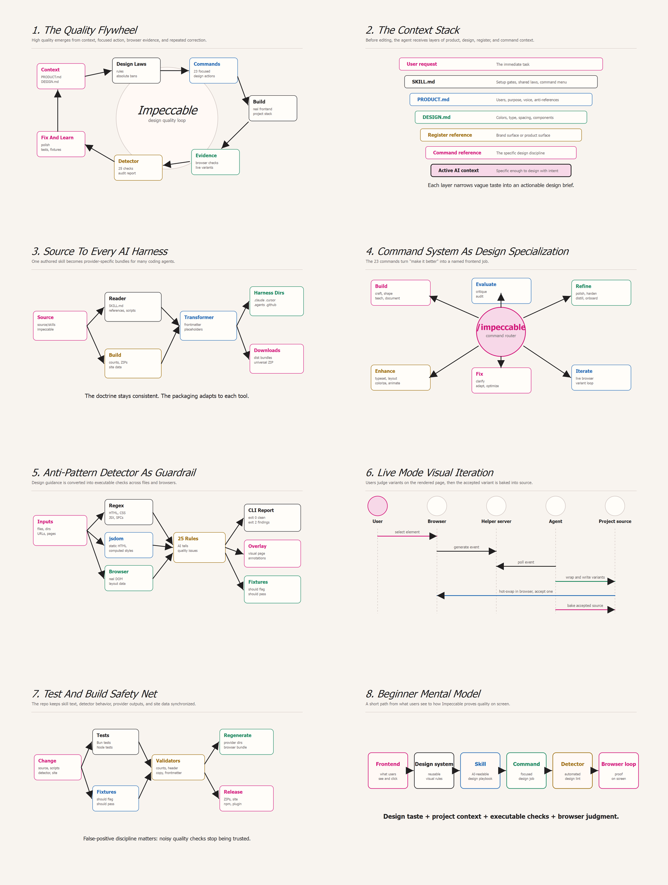
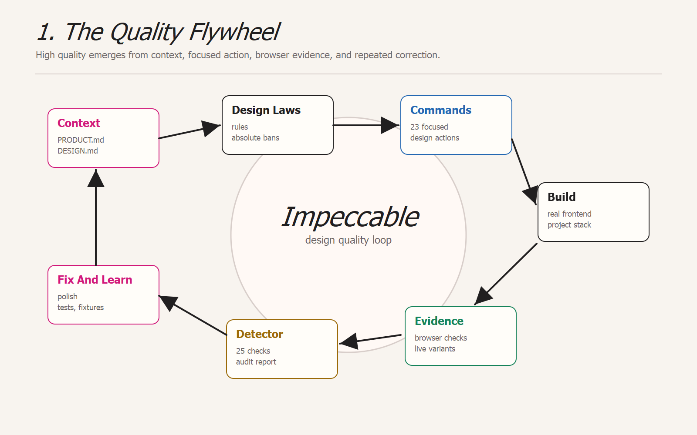
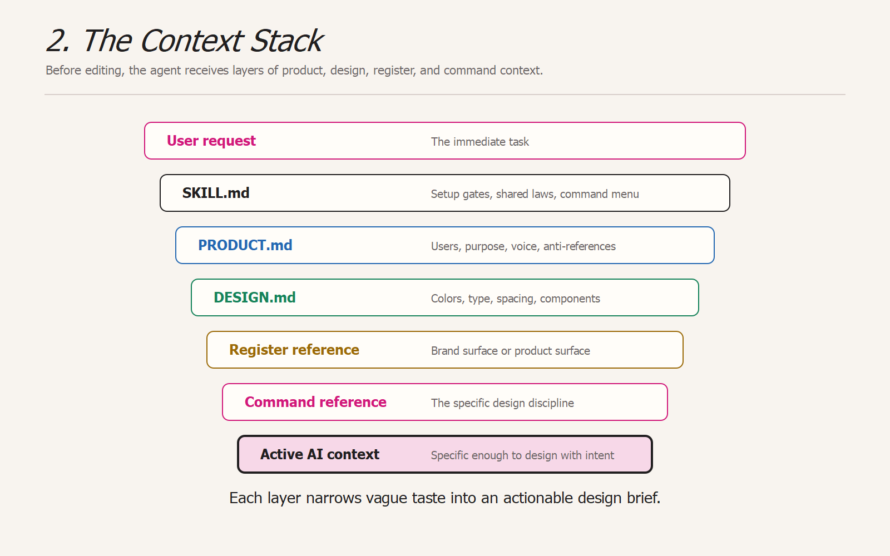
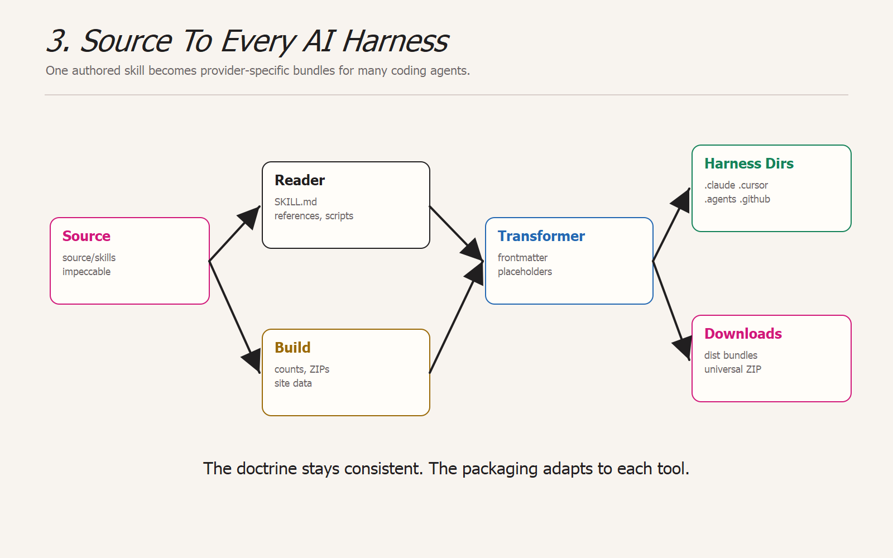
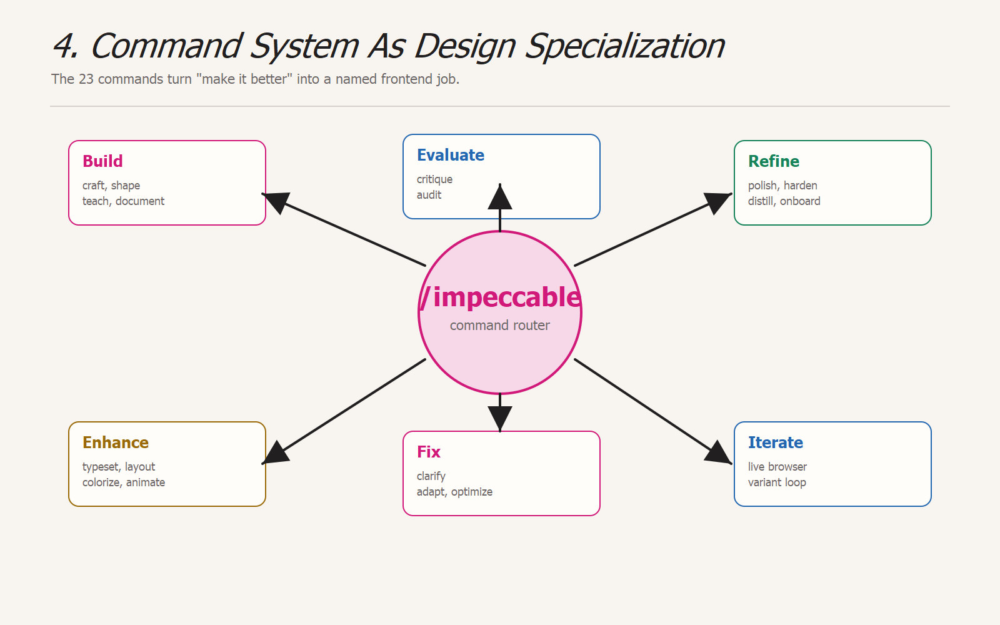
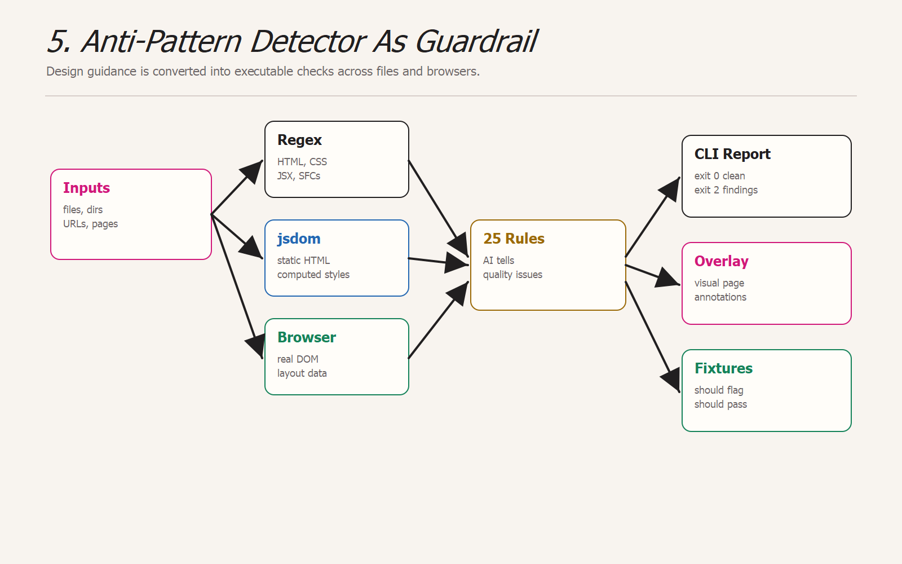
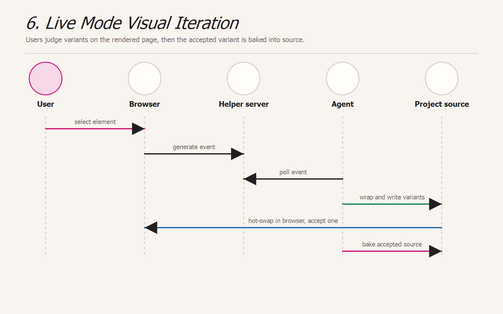
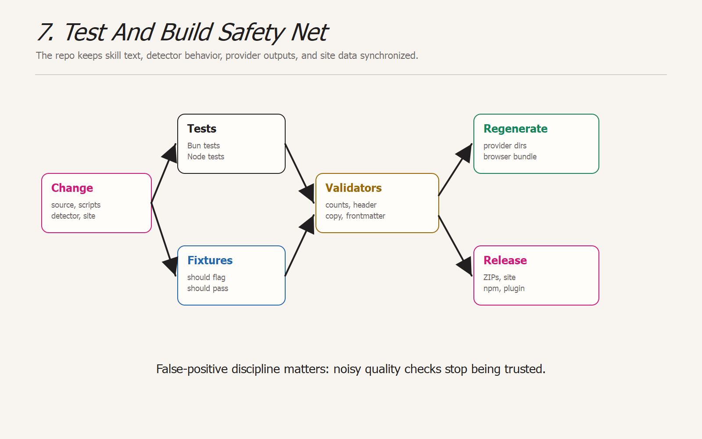
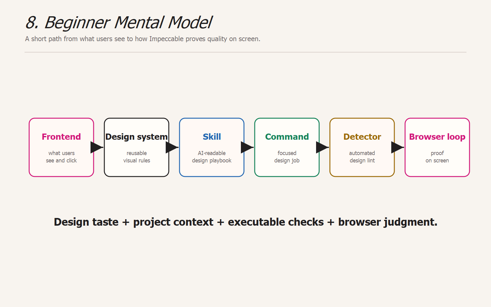

# Impeccable Quality Infographics

Audience: developers and non-designers who are new to Impeccable and frontend work.

Purpose: explain how this repository turns design judgment into repeatable AI behavior, shipped skill bundles, browser feedback loops, and deterministic checks.

This file uses actual image assets, not Mermaid diagrams. PNG exports and inspectable SVG source files live in `codex_doc/infographics/`.

## Complete Sheet

## 1. The Quality Flywheel

Impeccable is not one prompt. It is a loop that starts with project context, routes to the right design discipline, produces code, inspects the rendered UI, and feeds lessons back into stricter guidance.

**What this means:** high quality comes from repeated constraint and evidence, not from a single "make it beautiful" instruction.

## 2. The Context Stack An Agent Receives

The skill builds a layered brief before the AI edits files. Each layer narrows the design space.

**Quality move:** the agent is forced to ask "what product is this, what visual system exists, what kind of surface is this, and which design discipline applies?"

## 3. Source To Every AI Harness

The repository keeps one source skill, then transforms it into the exact folder structure expected by each coding tool.

**Quality move:** all tools get the same design doctrine, but each gets syntax that its harness can actually load.

## 4. Command System As Design Specialization

The 23 commands keep broad UI work from collapsing into generic advice.

**Quality move:** "make it better" becomes a named job: type, layout, color, motion, copy, responsiveness, performance, edge cases, or live visual exploration.

## 5. Anti-Pattern Detector As Guardrail

The detector catches common AI-generated UI tells and general frontend quality problems in several runtime contexts.

**Quality move:** the same taste rules are not left as prose only. Many are converted into executable checks.

## 6. Live Mode Visual Iteration

Live mode lets a user select an element in the browser, request variants, and accept one back into source.

**Quality move:** visual judgment happens on the actual rendered page, not in a detached chat response.

## 7. Test And Build Safety Net

The repository protects quality through focused tests, fixture coverage, generated counts, and provider rebuilds.

**Quality move:** authoring rules, runtime detectors, generated bundles, and public docs are checked together so the tool does not drift.

## 8. Beginner Mental Model

**Plain-English version:** Impeccable gives the AI a design playbook, asks it to use the right chapter, checks the result against known failure patterns, and encourages iteration in the browser until the interface looks intentional.

## Image Files

| Image | File |
|---|---|
| Complete sheet | `codex_doc/infographics/impeccable-quality-infographic-sheet.png` |
| 1. The Quality Flywheel | `codex_doc/infographics/01-quality-flywheel.png` |
| 2. The Context Stack | `codex_doc/infographics/02-context-stack.png` |
| 3. Source To Every AI Harness | `codex_doc/infographics/03-source-to-harnesses.png` |
| 4. Command System As Design Specialization | `codex_doc/infographics/04-command-specialization.png` |
| 5. Anti-Pattern Detector As Guardrail | `codex_doc/infographics/05-detector-guardrail.png` |
| 6. Live Mode Visual Iteration | `codex_doc/infographics/06-live-mode.png` |
| 7. Test And Build Safety Net | `codex_doc/infographics/07-test-build-safety-net.png` |
| 8. Beginner Mental Model | `codex_doc/infographics/08-beginner-mental-model.png` |

## Code Evidence Map

| Concept | Primary files |
|---|---|
| Skill entrypoint and shared design laws | `source/skills/impeccable/SKILL.md` |
| Command catalog | `source/skills/impeccable/scripts/command-metadata.json` |
| Command and domain references | `source/skills/impeccable/reference/*.md` |
| Product and design context loader | `source/skills/impeccable/scripts/load-context.mjs` |
| Live mode boot, poll, wrap, accept flow | `source/skills/impeccable/scripts/live*.mjs` |
| Provider build pipeline | `scripts/build.js`, `scripts/lib/transformers/*.js` |
| Anti-pattern rules and CLI detector | `src/detect-antipatterns.mjs`, `bin/cli.js` |
| Browser detector bundle | `src/detect-antipatterns-browser.js`, `scripts/build-browser-detector.js` |
| Fixtures and regression tests | `tests/fixtures/antipatterns/`, `tests/*.test.*` |
